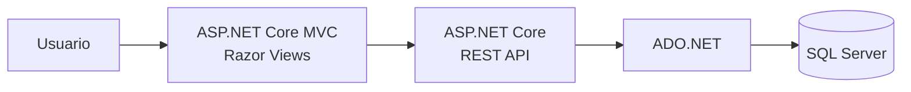

# 💼 AXOS — Portal de Empleo Tecnológico

> Plataforma Full Stack diseñada para conectar profesionales del sector tecnológico con empresas y oportunidades laborales.

AXOS es un proyecto académico desarrollado con **.NET 8**, compuesto por una aplicación web en **ASP.NET Core MVC** y una **API REST independiente**.

La plataforma permite que candidatos exploren y postulen a vacantes, mientras que las empresas pueden publicar ofertas, administrar procesos de selección y gestionar postulantes. El sistema incorpora autenticación, autorización basada en roles y persistencia en SQL Server mediante ADO.NET.

---

## 🚀 Funcionalidades principales

### 👨‍💻 Candidatos

- Registro e inicio de sesión.
- Exploración de ofertas laborales.
- Filtros por especialidad, modalidad y salario.
- Consulta del detalle de cada vacante.
- Postulación a ofertas.
- Seguimiento de postulaciones realizadas.
- Prevención de postulaciones duplicadas.
- Gestión de información de perfil.

### 🏢 Empresas

- Registro de cuenta empresarial.
- Publicación de ofertas laborales.
- Edición y administración de vacantes.
- Activación y desactivación de ofertas.
- Visualización de postulantes.
- Gestión del estado de cada candidatura.
- Panel de ofertas publicadas.

### 🛡️ Administración

- Gestión de usuarios y empresas.
- Supervisión de vacantes.
- Consulta de ofertas por empresa.
- Administración de información maestra.
- Acceso a funcionalidades restringidas según rol.

---

# 🏗️ Arquitectura

AXOS está dividido en dos aplicaciones principales:



Esta separación permite mantener la interfaz web desacoplada de la capa encargada del acceso y procesamiento de datos.

---

# 🧩 Estructura de la solución

```text
Axos/
│
├── database/
│   └── PortalFinal.sql
│
├── src/
│   │
│   ├── Proyecto-API/
│   │   └── Proyecto-API/
│   │       ├── Controllers/
│   │       ├── DAO/
│   │       ├── DTO/
│   │       ├── Entidades/
│   │       ├── Helpers/
│   │       └── Services/
│   │
│   └── Proyecto_WEB/
│       └── Proyecto_WEB/
│           ├── Controllers/
│           ├── Models/
│           ├── Services/
│           ├── Views/
│           └── wwwroot/
│
└── README.md
```

---

# 💻 Stack tecnológico

## Backend

- C#
- .NET 8
- ASP.NET Core Web API
- ADO.NET
- Microsoft.Data.SqlClient
- Swagger / OpenAPI

## Frontend

- ASP.NET Core MVC
- Razor Views
- HTML5
- CSS
- JavaScript

## Base de datos

- Microsoft SQL Server
- Scripts SQL
- Procedimientos y consultas gestionadas mediante ADO.NET

## Arquitectura

- MVC
- REST API
- DAO
- Service Layer
- DTO
- Separación Web / API

---

# 🔐 Autenticación y autorización

La aplicación web implementa autenticación basada en cookies mediante ASP.NET Core.

El sistema utiliza diferentes roles para controlar el acceso a las funcionalidades:

```text
Candidato
Empresa
Admin
```

Ejemplos de autorización:

- Solo las empresas pueden publicar ofertas.
- Empresas y administradores pueden gestionar postulantes.
- Los candidatos pueden explorar y postular a vacantes.
- Las funcionalidades administrativas están restringidas según el rol.

La sesión autenticada almacena claims como:

- Nombre.
- Correo electrónico.
- Rol.
- Identificador del usuario.

---

# 🔎 Exploración de ofertas

El portal permite filtrar oportunidades laborales utilizando diferentes criterios:

- Especialidad.
- Modalidad.
- Salario mínimo.

Cada oferta cuenta con información detallada sobre la empresa, requisitos y características de la posición.

El sistema también verifica si el candidato ya se encuentra postulado antes de permitir una nueva solicitud.

---

# 📨 Gestión de postulaciones

Las empresas pueden consultar los candidatos vinculados a cada oferta y modificar el estado de su proceso de selección.

Esto permite representar un flujo básico de reclutamiento dentro de la plataforma.

Ejemplos de estados pueden incluir:

```text
Postulado
En revisión
Aceptado
Rechazado
```

---

# 🗄️ Persistencia de datos

AXOS utiliza **SQL Server** como motor de base de datos.

La comunicación con la base de datos se realiza mediante **ADO.NET**, utilizando una capa DAO que separa la lógica de persistencia de los controladores y servicios.

Entre las principales entidades se encuentran:

- Usuarios.
- Empresas.
- Ofertas de trabajo.
- Postulaciones.
- Especialidades.
- Habilidades.
- Ubicaciones.

---

# 📡 API REST

La solución incorpora una API independiente encargada de las operaciones principales del sistema.

Entre sus controladores se encuentran:

```text
AccesoController
EmpresaController
MaestroController
OfertaTrabajoController
PostulacionController
UsuarioController
```

La API puede explorarse durante el desarrollo mediante **Swagger/OpenAPI**.

---

# ⚙️ Ejecución local

## Requisitos

- .NET 8 SDK
- SQL Server
- SQL Server Management Studio o herramienta equivalente
- Visual Studio 2022 o VS Code
- Git

## 1. Clonar el repositorio

```bash
git clone https://github.com/MtrXisback/Axos.git
cd Axos
```

## 2. Crear la base de datos

Ejecuta el script ubicado en:

```text
database/PortalFinal.sql
```

desde SQL Server Management Studio.

## 3. Configurar la conexión

Configura la cadena de conexión correspondiente en los archivos:

```text
appsettings.json
```

de acuerdo con tu instancia local de SQL Server.

## 4. Ejecutar la API

```bash
cd src/Proyecto-API/Proyecto-API
dotnet restore
dotnet run
```

## 5. Ejecutar la aplicación web

En otra terminal:

```bash
cd src/Proyecto_WEB/Proyecto_WEB
dotnet restore
dotnet run
```

---

# 🎯 Objetivos técnicos

AXOS fue desarrollado para aplicar conceptos de:

- Desarrollo Full Stack con .NET.
- ASP.NET Core MVC.
- Diseño de APIs REST.
- Arquitectura por capas.
- Autenticación y autorización.
- Control de acceso basado en roles.
- Consumo de APIs desde una aplicación MVC.
- Persistencia mediante ADO.NET.
- Modelado de bases de datos relacionales.
- Gestión de procesos de negocio.

---

# 🔮 Posibles mejoras

Entre las mejoras futuras del proyecto se podrían incorporar:

- Autenticación JWT para la API.
- Entity Framework Core como alternativa de persistencia.
- Notificaciones por correo.
- Recuperación de contraseña.
- Búsqueda avanzada de candidatos.
- Matching entre habilidades y ofertas.
- Dockerización.
- Pipeline CI/CD.
- Despliegue en Cloud.
- Pruebas automatizadas.

---

# 🎓 Contexto

Proyecto académico desarrollado como parte de la formación en **Computación e Informática**.

El objetivo fue construir una solución empresarial completa que permitiera aplicar conceptos de frontend, backend, APIs, seguridad, bases de datos y gestión de procesos de selección.

---

# 👨‍💻 Autor

**Miguel Alonso Villon Alcantara**

Desarrollador Full Stack Jr.

- GitHub: [@MtrXisback](https://github.com/MtrXisback)
